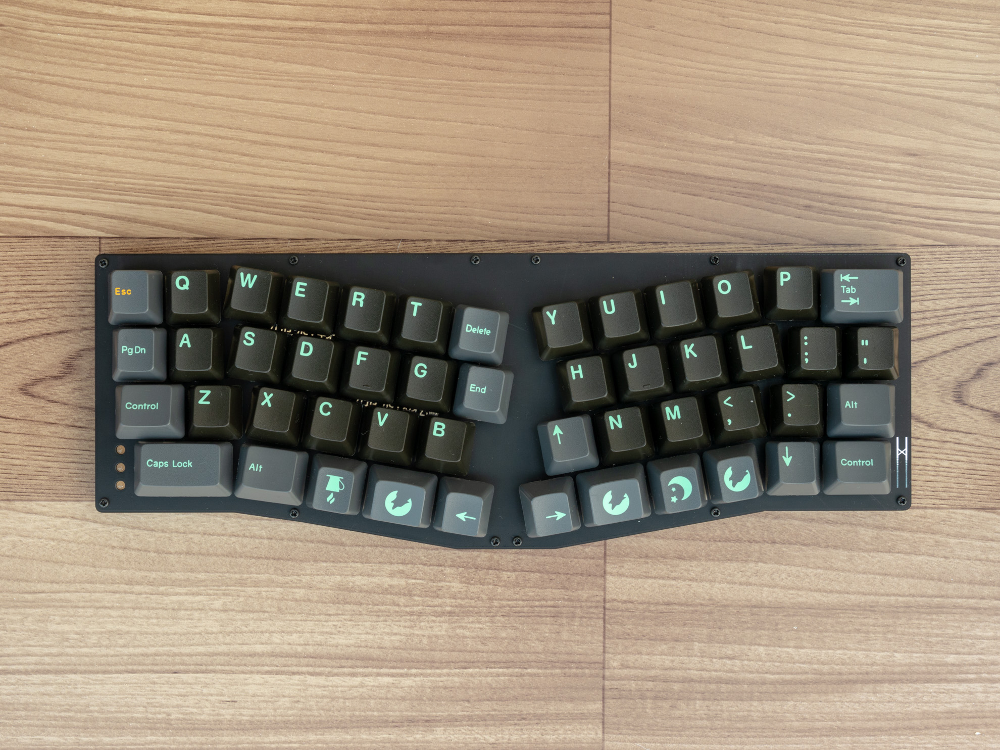

Build guide for Lain
----------------------------
Lain is ergonomic row staggered 40% keyboard.

- Cherry MX compatible switch
- kailh hotswap socket
- USB Type-C connector
- PCB mount plate, bottom plate & acrylic sandwitch case
- pre soldered pcb
- lainttl (https://www.nbcuni.co.jp/rondorobe/anime/lain/ttl/)

## Build guide
### Rev.1 (Group buy)
- [Rev.1 日本語](buildguide_rev1_jp.md)
- [Rev.1 English](buildguide_rev1_en.md)

### Rev.Alpha
- [日本語](buildguide_alpha_jp.md)
