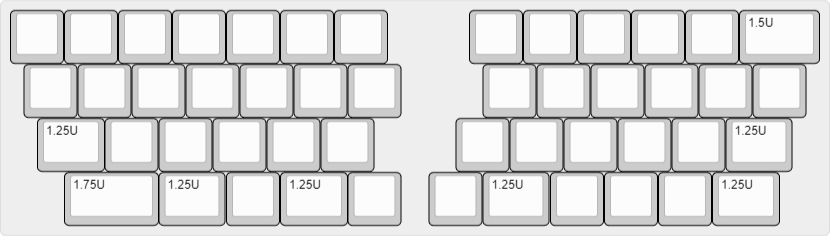
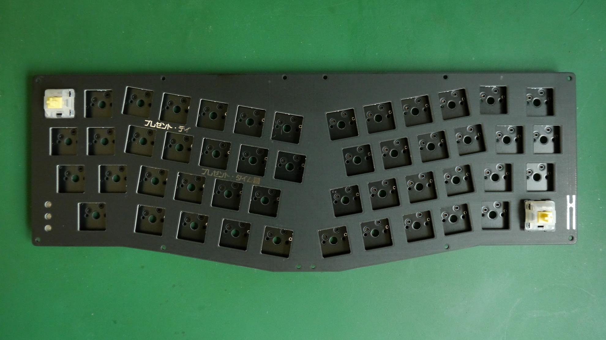
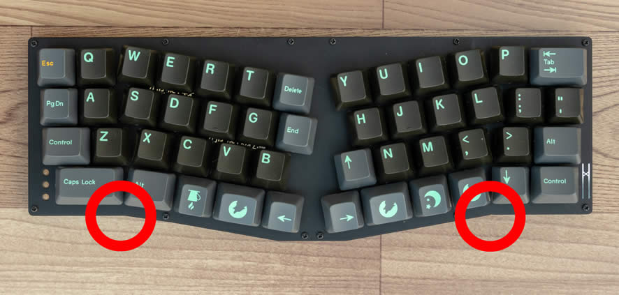

# Lain ビルドガイド

***組み立てを始める前に必ず最後まで一通り目を通して下さい***

## パーツリスト
### キットに含まれるもの
|                    | 個数 |                                     |
|--------------------|------|-------------------------------------|
| メインPCB          | 1    | 実装済みPCB                         |
| プレートPCB        | 1    |                                     |
| ボトムPCB          | 1    |                                     |
| アクリルパーツ(右) | 1    | アクリルパーツは左右異なる物が1ペア |
| アクリルパーツ(左) | 1    |                                     |
| ネジ類             | 1    | M2*14mm 12個、M2ナット12個          |
| ゴム足             | 4    |                                     |

### その他必要なもの
- Cherry MX互換スイッチ 49個
- キーキャップ
  - 一般的な101英語キーボード用のもので一通り揃います
- USB type-cケーブル

## レイアウト


## 組み立て
### メインPCBの動作確認
組立前にメインPCBの動作確認をします。   
メインPCBにはデフォルトのファームウェアが予め書き込まれています。   
USBケーブルでPCと接続し正しく認識されているか、適当なジャンパー線などでソケットのパッドをショートさせて文字が入力されるか確認して下さい。

また、目視でソケット、USBコネクタのはんだづけを確認して下さい。   

### プレートとスイッチの取り付け
プレートにスイッチを1つはめ込み、メインPCBへ差し込みます。   
このとき、***スイッチのピンが曲がっていないこと***、***スイッチの方向*** を必ず確認して下さい。   
無理に取り付けた場合ソケットがメインPCBから剥がれてしまいます。

端のスイッチから対角になるよう順番に取り付けていきます。



### スイッチの動作確認
すべてのスイッチが正しく動作するかPCに接続して確認して下さい。

### ケースの組み立て
アクリルの保護紙を剥がしてキーボードにネジ止めします。   
アクリルパーツには左右があります。   
手前側の曲がっている部分で見分けることができます。   



基板の側面を黒油性ペンで塗ると基板の端面が目立ちません。

## ファームウェア
QMK Firmwareに対応しています。   
公式のリポジトリにはまだmergeされていないため、以下のURLよりcloneして下さい。   
https://github.com/hsgw/qmk_firmware/tree/lain

### 書き込み方法
#### ブートローダへの入り方
ファームウェアを書き込む際にはあらかじめキーボードをブートローダモードにしておく必要があります。   
以下のどちらかの方法でブートローダへ入りファームウェアの書き換えが可能になります。
1. QMK Firmwareの```RESET```キーコードを押す
    - Defaultのファームウェアであればレイヤー切り替えキーを2つとも同時押しして左上端のキーを押す
      (https://github.com/hsgw/qmk_firmware/blob/lain/keyboards/lain/keymaps/default/keymap.c#L49)
2. 基板上のタクトスイッチを使う
    1. Resetスイッチを押す
    2. Bootスイッチを押す
    3. Resetスイッチを離す
    4. Bootスイッチを離す

### ファームウェアのビルドと書き込み
キーボードを```ブートローダモード```にしてから
```
make lain:default:dfu-util
```

### 問い合わせ先
パーツの不足、不具合、ご質問は以下へお願いします。

info@5z6p.com