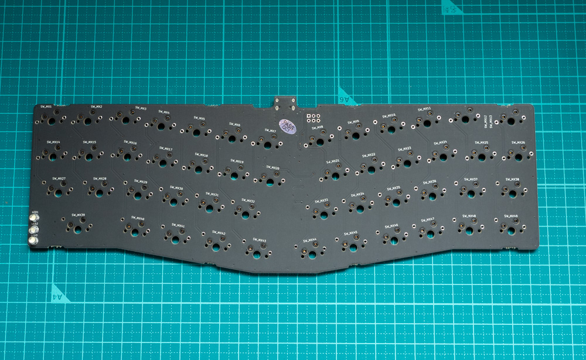
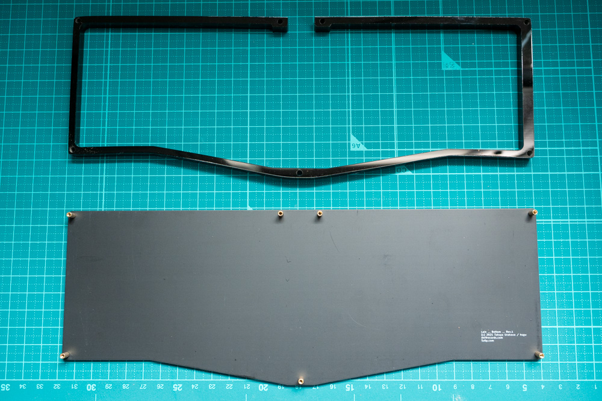
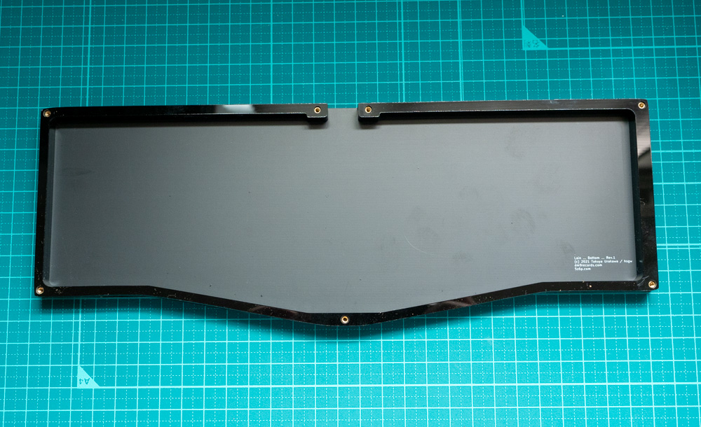
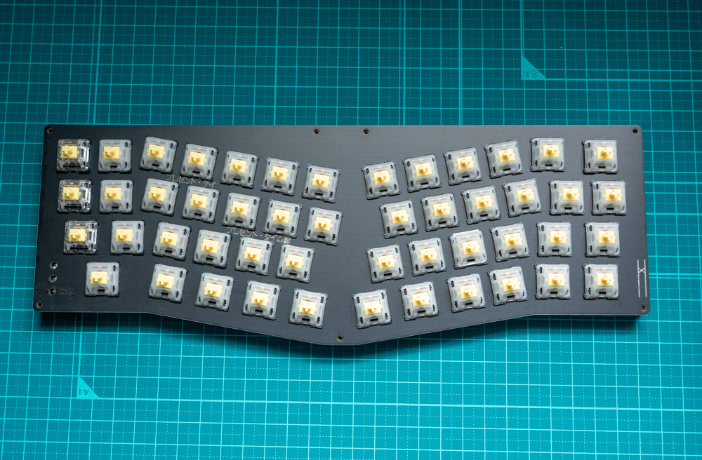

# Lain Rev.1 Build Guide

***Please be sure to read this build guide before assembly***

## Contact
If you have any questions during assembly or missing parts, please contact us at info@5z6p.com

## Parts list
|                    | Qty |                                     |
|--------------------|------|-------------------------------------|
| main PCB           | 1    | Assembled PCB                         |
| switch plate       | 1    |                                     |
| buttom plate       | 1    |                                     |
| acrylic middle     | 1    | 　　　　　　　　　　　　　　　　　　 　　|
| screws             | 1    | M2*4mm screws *14, M2*7mm standsoffs *7   |
| rubber foot        | 4    |                                     |
| sticker            | 1    |                                     |

## Pre-assembly operation check

1. Connect the main PCB to your computer with a USB cable
2. Check operation using Remap
    - [How to Use Remap](how_to_use_remap_en.md)

## Assembly
### Clean acrylic middle part
The acrylic parts are dirty from the polishing process. After removing the protective paper, gently wipe with a soft cloth or paper or rinse with water and dry well.

Due to the manufacturing process, there are scratches on the sides.   
We have removed the scratches after polishing, but if you want to make it perfect, please polish it again with sandpaper or polishing compound.

> See this blog for more information on scratches on acrylic middle part
> https://5z6p.com/2022/02/03/lain-group-buy-update-4/
> 
> I also share the DXF file of acrylic middle part for those who want to remake or customize acrylic parts.   
> Please use this file as well.  
> 

### Install switches
Install the switch on the main PCB and switch plate.   
To prevent damage to the sockets and switches, the following points should be noted

- ***Keep the legs of the switch in straight***
- ***Do not apply too much force***
- ***Press the socket from the back when inserting the switch***
  

### Check operation of switches
Check the operation of the switch with Remap in the same way as the pre-assembly operation check.
- [How to Use Remap](how_to_use_remap_en.md)

### Prepare the bottom case
Attach the spacers to the bottom plate with screws.    
After attaching all the spacers, place the acrylic middle part.   
Acrylic middle part have a specific direction for installation. Please see below photo.

The holes for spacers are small to prevent wobbling.   
If the acrylic middle part does not fit smoothly, install it carefully while gently bending the acrylic middle part.

### Complete
Screw the switch plate + main PCB into the prepared bottom case.

## Replace switches
When replacing a switch, to prevent damage, be sure to remove the bottom plate and insert the new switch while holding the socket.

## Customize keymap
This keyboard is compatible with [Remap](https://remap-keys.app)   
- [How to Use Remap](how_to_use_remap_en.md)  
**Does not compatible with via comfigulator**

## LEDs
The LEDs are set as indicators for `CAPS LOCK`, `LAYER 1`, and `LAYER 2`.   
The firmware must be modified to make the change. 

## Firmware
[QMK Firmware](https://github.com/qmk/qmk_firmware)   
https://github.com/qmk/qmk_firmware/tree/master/keyboards/dm9records/lain