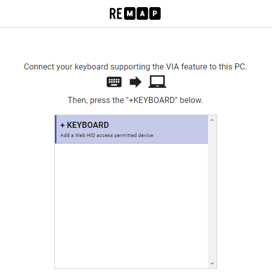
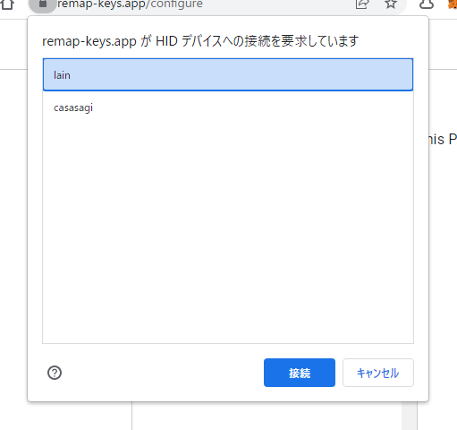
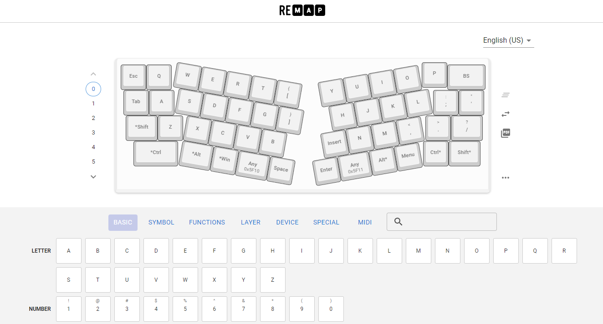
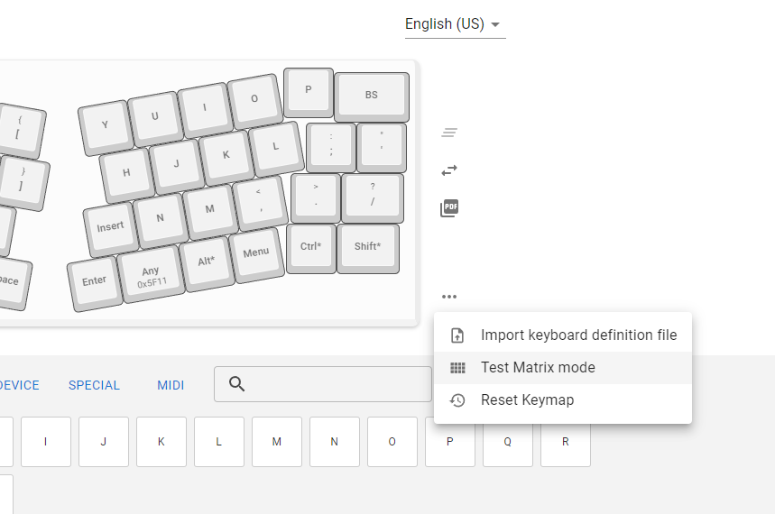
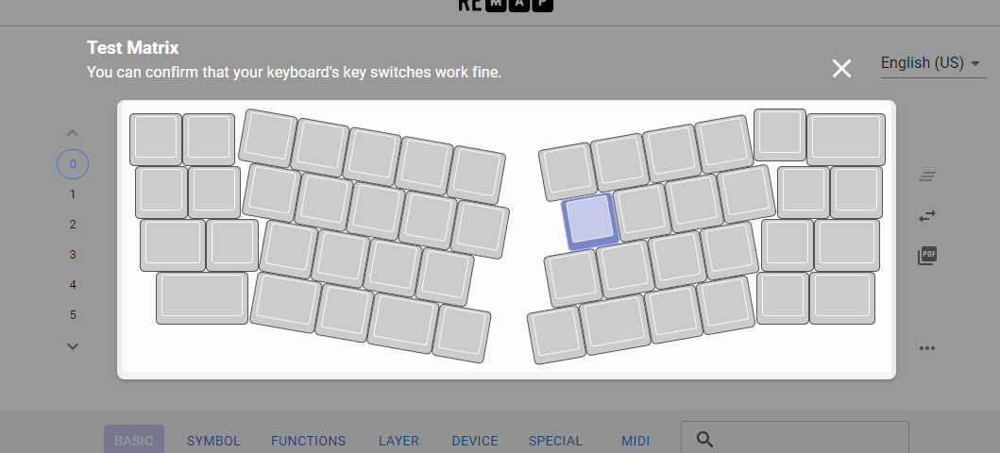

# How to use Remap
Remap(https://remap-keys.app/) is an application for customize your keyboard keymap from web browser. 

## Recognize keyboard
1. Connect keyboard and PC with USB cable
2. Open https://remap-keys.app/
3. Click `START REMAP FOR YOUR KEYBOARD`
4. Click `+ KEYBOARD`
   
5. Select keyboard from list
   
6. After recognized, keymap is displayed
   

## Customize keymap
Drag and drop from list to keymap or click keymap

To write it to the keyboard, click `flash`

## Test keyboard
1. Connect keyboard to remap
2. Select `Test Matirx Mode` from the menu in the lower right corner of the keymap view
   
3. When a key is pressed, the color of key changes
   