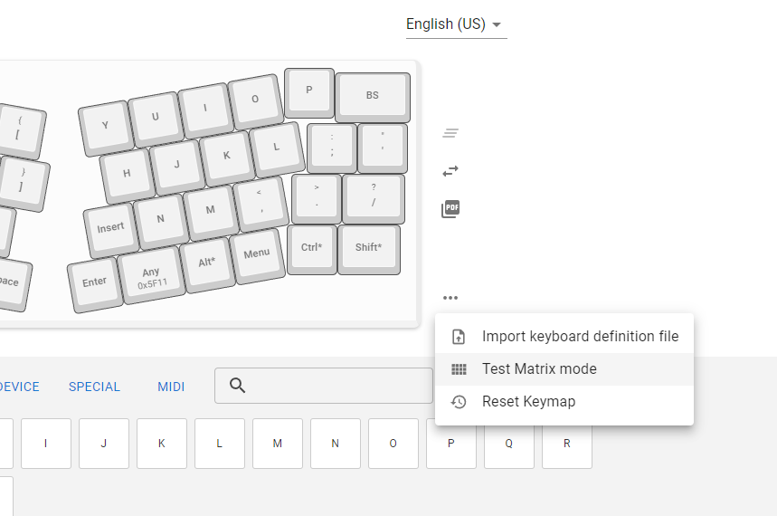
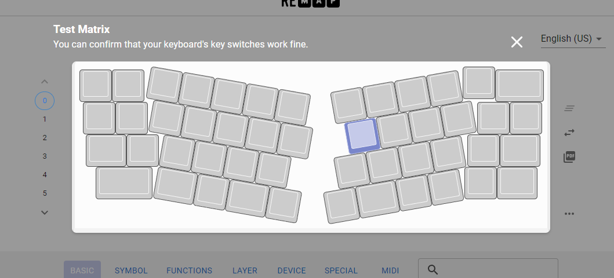

# Remapの使い方
Remap(https://remap-keys.app/)はブラウザからキーボードのキーマップを変更するためのアプリケーションです。

## キーボードを認識させるまで
1. キーボードとPCをUSBケーブルで接続する
2. https://remap-keys.app/ を開く
3. `START REMAP FOR YOUR KEYBOARD` をクリック
4. `+ KEYBOARD` をクリック
   
5. 一覧からキーボードを選択
   
6. 成功するとキーマップが表示される
   

## キーマップの書き換え
キーボードが接続中なら、ドラッグアンドドロップやキーをクリックするとキーマップを変更できます。
キーボードに書き込むには、`flash` をクリックします。

## キーボードの動作確認
1. キーボードをRemapに接続する
2. キーマップ表示部のメニューから `Test Matirx Mode` を選択する
   
3. 入力のあったキーの色が変わる
   